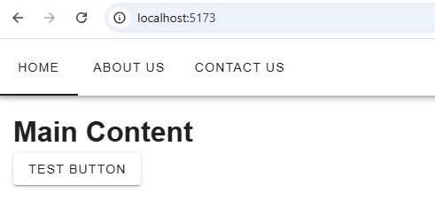

# Top navigation

This derive from the setup of vue + vuetify  

Quick example to introduce building top nav

## Example 1 


### component creation
 - create inside components new component name TopNav.vue
 - add the following code inside
```typescript
<script lang="ts">
export default {
  data() {
    return {
    }
  },
}
</script>
<template>
  <div>
    <v-app-bar dense>
      <v-tabs>
        <v-tab>Home</v-tab>
        <v-tab>About Us</v-tab>
        <v-tab>Contact Us</v-tab>
      </v-tabs>
    </v-app-bar>
  </div>
</template>
```
 - import it int app.vue as following
```typescript
<script setup lang="ts">
import TopNav from './components/TopNav.vue'
</script>
<template>
  <v-responsive class="border rounded">
    <v-app>
      <TopNav/>      
      <v-navigation-drawer>
        <v-list>
          <v-list-item title="Navigation drawer"></v-list-item>
          <v-list-item title="Navigation 1"></v-list-item>
          <v-list-item title="Navigation 2"></v-list-item>
        </v-list>
      </v-navigation-drawer>

      <v-main>
        <v-container>
          <h1>Main Content</h1>
          <v-btn> test button </v-btn>
        </v-container>
      </v-main>
    </v-app>
  </v-responsive>
</template>
<style scoped></style>
```
- and done

extra for generating it automaticaly

```typescript
<script lang="ts">
export default {
  data() {
    return {
      tabItems: [
        { title: 'Home', path: '/home' },
        { title: 'About Us', path: '/aboutus' },
        { title: 'Contact Us', path: '/contactusn'},
      ],
    }
  },
}
</script>

<template>
  <div>
    <v-app-bar dense>
      <v-tabs>
        <v-tab v-for="item in tabItems" :key="item.title">{{
          item.title
        }}</v-tab>
      </v-tabs>
    </v-app-bar>
  </div>
</template>
```

# Reference
- [Vuetify Navigation ](https://vuetifyjs.com/en/components/app-bars/#usage)
- [https://salifyataala.medium.com/top-navigation-bar-in-vuetify-part-one-74c0d445bdde](https://salifyataala.medium.com/top-navigation-bar-in-vuetify-part-one-74c0d445bdde) 
- [full sandbox example](https://codesandbox.io/p/sandbox/vuetify-top-navbar-sivre)


Example but seem not working with version 3 of vuetify  
 - https://codesandbox.io/p/sandbox/vuetify-top-navbar-frhu8?file=%2Fpackage.json%3A18%2C23
 - 